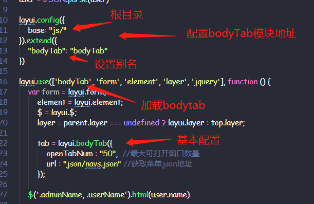
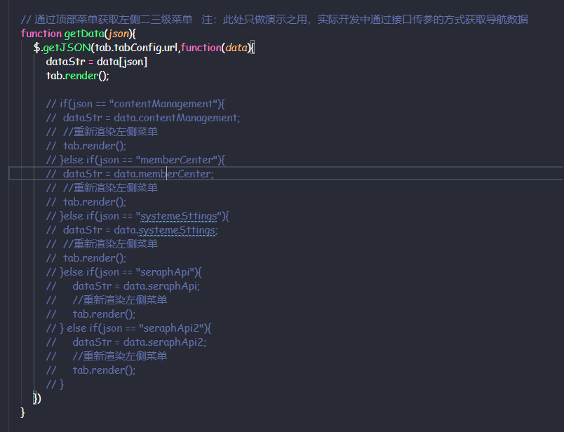
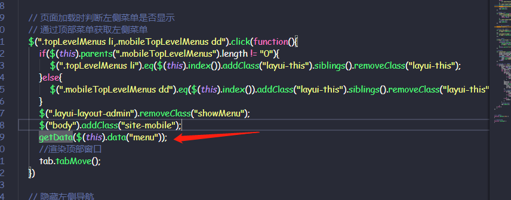
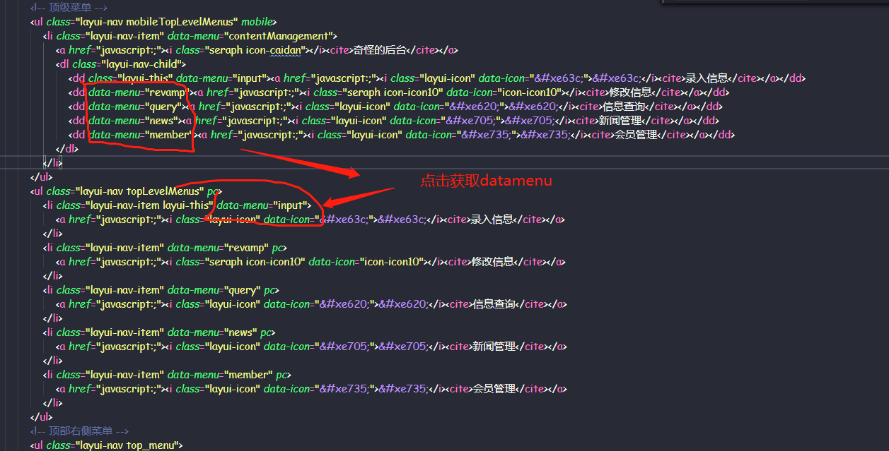
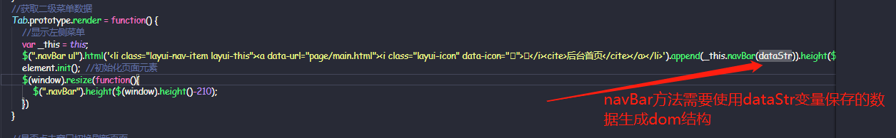
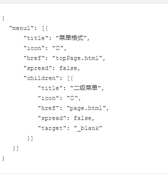
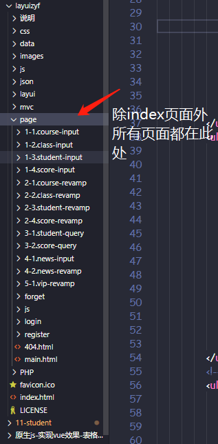
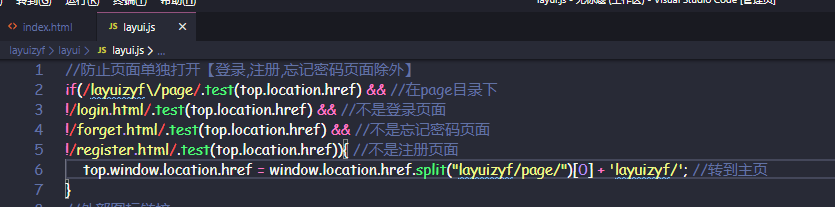

## layuicms

+ [layui开发文档](https://www.layui.com/doc/)
+ [bodyTab使用文档](http://jxweb1.jyu.edu.cn/zt312lhpy/public/layuicms/page/doc/bodyTabDoc.html)

### 1.bodyTab使用

+ 超小声: '其实我一直都没注意这个东西, 就直接把他原来的注掉干了个简单的tab切换, 刚改过来' (笑)

+ bodyTab模块是layuiCMS 2.0的核心，通过简单的配置就能实现**左侧导航**的输出、点击菜单添加新窗口的功能
+ 使用
  + 
+ getData方法
  + 通过传入的标记获取到对应json对象并赋值给dataStr, 然后执行左侧tab渲染
  + 
  + 使用:
    + 点击顶部tab时
      + 
    + 全局代码执行时也调用了一次, 首先渲染第一个tab的左侧列表
+ data-menu
  + data('menu')方法获取到了tab中的data-menu属性值, 传入getData使用
  + 

+ dataStr: 肯定会有人疑惑这是个什么东西
  + 

+ json完整格式
  +  

### 2.page文件夹

+ 
+ 主页中的所有tab页都是通过ifrem标签引入的page文件夹下页面
+ 注意: 
  + cms中内置的layui.js 添加了一步判断, 单独打开某个页面会跳转到主页
  + 

### 3.layui使用秘诀

+ 文档不离手

+ 写代码时口中默念: '我是一个莫得感情的复制粘贴机器'

  